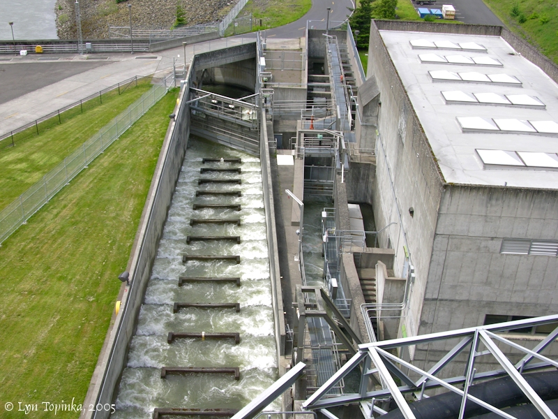

```{r setup, include=TRUE, message=FALSE, warning = FALSE}
knitr::opts_chunk$set(echo = TRUE,
                      message = FALSE,
                      warning = FALSE)

#attach necessary packages
library(tidyverse)
library(here)
library(janitor)
library(lubridate)
library(paletteer)
library(tsibble)
library(fable)
library(fabletools)
library(feasts)
library(forecast)
```
### **Introduction:** 
This data was provided by the Columbia Basin Research DART, which is affiliated with the University of Washington [1]. The data set goes back to 1939 and shows the daily record of the number of steelhead salmon that have passed through the Bonneville Dam which was built across the Columbia River that seperates Oregon and Washington. The Bonneville Dam has a fish ladder that was constructed in 1937 which has helped facilitate migration of steelhead salmon and other salmon species back to their spawning grounds. [2] Steelhead salmon were added onto the Endangered Species Act in 1999, and this analysis will partially look at how populations, as measured by movement up the river, have responded since that time. [3]




```{r}
#read in data file

salmon_data <- read_csv(here::here("data","cbr_fish_passage_bonneville_allyrs_steelhead.csv")) %>% 
  janitor::clean_names()
```

```{r}
#start by tidying and cleaning up the data set, getting dates into different columns, combing for one aggregate date column, and parsing out each column separately to work in tsibble with

salmon_clean <- salmon_data %>% 
  unite("ydm", year:mm_dd, sep = "-", remove=FALSE) %>% 
  mutate(yr_mon_day = parse_date_time(ydm, "ydm")) %>% 
  mutate(yr_mon = parse_date_time(ydm, "ym")) %>% 
  mutate(month = month(yr_mon_day, label = TRUE)) %>% 
  mutate(year = year(yr_mon_day)) %>% 
  mutate(day = day(yr_mon_day)) %>% 
  mutate(value = as.numeric(value)) %>% 
  mutate(yr_mon_day = as_date(yr_mon_day)) %>% 
  drop_na()


```

```{r}
#alright, now time to create the different time series data frames 

#first A finalized time series plot of the original observations (daily data)

salmon_daily <- ggplot(data = salmon_clean, aes(x = ydm, y = value, group = year)) +
  geom_line(aes(color = month)) + 
  theme_minimal()

salmon_daily + scale_color_paletteer_d(("palettetown::alakazam"))

#this graph makes me want to throw up, I am going to cut down the time frame 

```

### **Daily Count Information**
```{r, fig.cap='The figure shows the individual counts of steelhead salmon at the Bonneville Dam from 2015 to 2019. Each individual point represents one day. Each year starts on Januaray 1st, and ends December 31st.'}
#second attempt at the daily graph
daily_df <- salmon_clean %>% 
  filter(year %in% c("2015","2016","2017","2018","2019")) 

daily_graph <- ggplot(data = daily_df, aes(x = yr_mon_day, y = value)) +
  geom_point(aes(color = value)) +
  labs(
    title = "Bonneville Dam Daily Steelhead Salmon Passage",
    subtitle = "From 2015 to 2019",
    x = "Date",
    y = "Number of Steelhead Salmon per Day",
    color = "Number of Salmon Counted"
  ) +
  theme_minimal()
daily_graph + scale_color_paletteer_c(("gameofthrones::targaryen"))
```

#### **Discussion**

- The figure above shows the daily counts of steelhead from the Bonneville Dam. There appears to be a trend among daily peaks occuring in the late summer months (August / September) but the peaks are decreasing as time goes on. While there does not appear to be any seasonality shift, lets look at monthly data from a longer time period to see if there is a discernable shift in salmon counts. 

### **Monthly Count Information**
```{r, fig.cap = 'This figure shows the monthly counts for steelhead salmon at the Bonneville Dam from 1975 until 2019. With the 80 year data set, each month is seperated, and values were derived by summing together daily counts from the dam by month and year.'}


#create a dataframe that has monthly counts
month_df <- salmon_clean %>% 
  group_by(year, month) %>% 
  summarize(
    month_count = sum(value)
  ) %>% 
  drop_na() %>% 
  filter(year %in% c(1975:2019))

month_graph <- ggplot(month_df, aes(x = year, y = month_count)) +
  geom_line(aes(color = month),
            size = 1.2,
            alpha = 0.8) +
  labs(
    title = "Monthly Steelhead Salmon Count at Bonneville Dam",
    subtitle = "Collected from 1975 - 2019",
    x = "Year",
    y = "# of Steelhead Salmon",
    color = "Month"
  ) +
  theme_minimal() +
  scale_y_continuous(limits = c(0, 150000)) +
  scale_x_continuous(limits = c(1975, 2020))

month_graph + scale_color_paletteer_d(("rcartocolor::Antique"))

```

```{r}
#looks good lets see if we can make this as a tsibble seasonal plot to see trends 

#create a tsibble data frame
month_ts <- as_tsibble(salmon_clean, key = month, index = yr_mon_day)

#hmm data frame has NAs, need to drop them or fill them

filled_month_ts <- fill_gaps(month_ts, .full = FALSE)
filled_month_ts %>% gg_season(value)

#that is terrible to look at

autoplot(filled_month_ts)
#this also tells me nothing, lets just stick with the original plot


```

#### **Discussion**

-Steelhead salmon are known to begin their run tpically in August. This is the period of their life where they return back to the stream in which they were born to reproduce and also die [4]. Throughout the time series data shown above, we see the highest runs and count of salmon being in these late summer months, primarily August, but occasionally in September. For the remainder of the year counts are relatively low. While there is a pattern of salmon movement between different months, there does not appear to be a trend between months increasing or decreasing, but rather they are indicating more annual trends than seasonal. 

### **Annual Count Information**
```{r, fig.cap = 'The figure above shows the annual counts of steelhead salmon from the Bonneville Dam from 1939 - 2019. Data was collected by summing daily counts for the entire year. The y-axis of 6 e+05 represents 300,000 total salmon for the year.'}
#annual counts

annual_df <- salmon_clean %>% 
  group_by(year) %>% 
  summarize(
    annual_count = sum(value, na.rm = TRUE)
  )

annual_graph <- ggplot(annual_df, aes(x = year, y = annual_count)) +
  geom_line(size = 1.2,
            color = "darkred") +
  labs(
    title = "Annual Steelhead Salmon Count at Bonneville Dam",
    subtitle = "Collected from 1939 - 2019",
    x = "Year",
    y = "# of Steelhead Salmon"
  ) +
  theme_minimal() +
  scale_y_continuous(limits = c(0, 300000)) +
  scale_x_continuous(limits = c(1935, 2020))

annual_graph
```

#### **Discussion:**

-The graph above shows the annual counts of steelhead salmon from the Bonneville Dam since data started being recorded in 1939. Steelhead salmon along the Columbia river had gained protected status under the Endangered Species act in 1999, and the graph above shows that in the decade following their listing the amount of salmon going through the dam increased dramatically. 


### **Citations:**

- 1) Boggs, C. T., M. L. Keefer, C. A. Peery, T. C. Bjornn, and L. C. Stuehrenberg. “Fallback, Reascension, and Adjusted Fishway Escapement Estimates for Adult Chinook Salmon and Steelhead at Columbia and Snake River Dams.” Transactions of the American Fisheries Society 133, no. 4 (July 1, 2004): 932–49. https://doi.org/10.1577/T03-133.1.
- 2) “DART Adult Passage Graphics & Text | Columbia Basin Research.” Accessed February 19, 2020. http://www.cbr.washington.edu/dart/query/adult_graph_text.
- 3) “Endangered Species Act, Columbia River Salmon and Steelhead, and the Biological Opinion.” Accessed February 20, 2020. https://www.nwcouncil.org/reports/columbia-river-history/endangeredspeciesact.
- 4) Raymond, Howard L. “Effects of Hydroelectric Development and Fisheries Enhancement on Spring and Summer Chinook Salmon and Steelhead in the Columbia River Basin.” North American Journal of Fisheries Management 8, no. 1 (February 1, 1988): 1–24. https://doi.org/10.1577/1548-8675(1988)008<0001:EOHDAF>2.3.CO;2.
