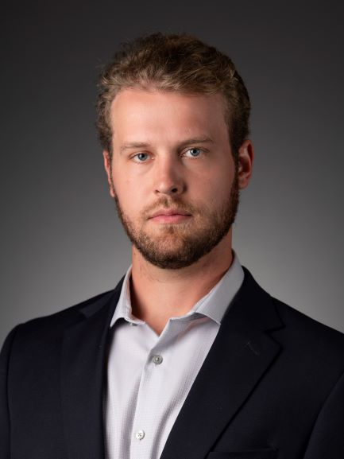

I graduated from the [University of Colorado](https://www.colorado.edu/ebio/) with a BA in Ecology and Evolutionary Biology in 2014. In 2019 I began working toward my MESM Economics and Politics of the Environment [The Bren School For Environmental Science and Management](http://www.bren.ucsb.edu/). My two foci at the Bren School are Environmental Data Science and Science Communication. I look forward to a future career in impact investing and pursuing hobbies related to science communication. My other hobbies include travel, fishing, spending time with my dog, and attending live music. 

While obtaining my undergraduate degree, I worked at the Institute of Arctic and Alpine Research under [Dr. Tim Seastest](https://www.colorado.edu/ebio/timothy-seastedt) where I performed research on how grassland and alpine plant communities respond to anthropogenic climate change. As a part of this project I published a paper specifically on how extreme precipitation events influence biogeochemical cycles and plant community response. Following my lab work at INSTAAR, I spent three years as an equity trader at Fidelity Investments, where I assisted high net worth clients with portfolio implementation. During this time I honed my financial skills to pursue a path of impact investing when I graduate from Bren. 

My full CV is available [here](files/Omasta_Resume.pdf).